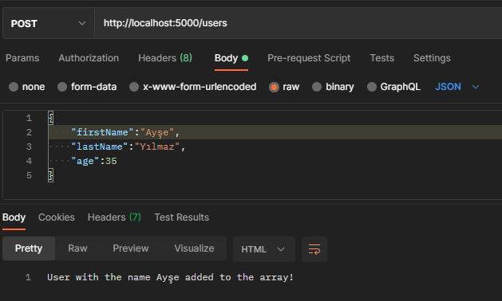
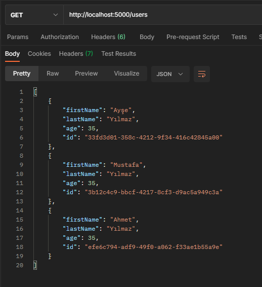
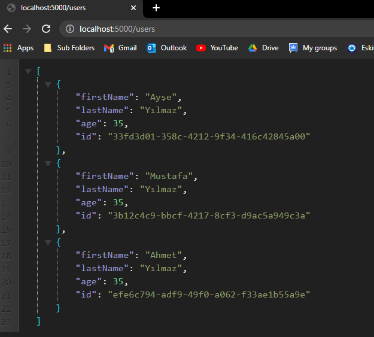
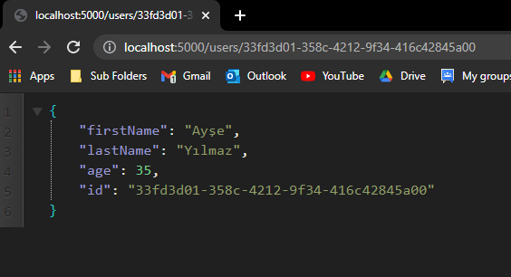
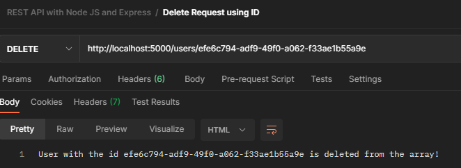
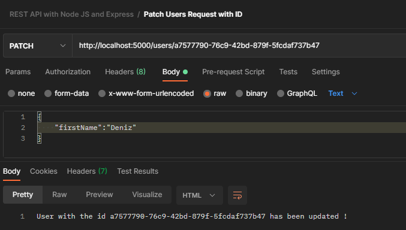

# restapi-nodejs
Bu projede Node.Js ve Express kullanarak REST API oluşturdum.Projeyi yapmak için JavaScript Mastery adlı YouTube kanalından yardım aldım.Link aşağıda yer almaktadır.Projedeki oluşturulan API CRUD işlemlerini yapmaktadır.

1)Post işlemi

2)Get request

3)Browser'da çıkan sonuçlar

4)Kullanıcı id'sine göre çıkan sonuç

5)Delete işlemi

6)Patch işlemi

Link: https://www.youtube.com/watch?v=l8WPWK9mS5M
